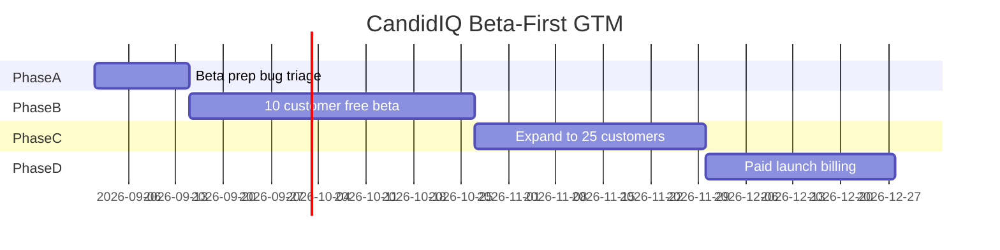

# CandidIQ — Go-To-Market Plan, Strategy & Timeline

**Version:** 1.1 · August 25, 2026 (updated with Bryan’s decisions)  
**Companion doc:** [CandidIQ-GTM-Intake-FILLED.md](./CandidIQ-GTM-Intake-FILLED.md)  
**Assumptions:** Free beta with 10 existing SMB clients first; **25 customers by day 90**; paid launch after stability; existing-client discount when billing goes live.

---

## Executive summary

CandidIQ is **not ready to charge yet** — Bryan’s assessment: glitches remain and some features (Tech Spend, member Frank, etc.) are not fully working. The right motion is **beta-first, not paid-first**.

**Revised GTM motion:**

1. **Invite 10 existing Candid SMB customers** into a **free beta** (no charge)
2. **Demo + free savings analyses** — prove value through published deliverables, not checkout
3. **Fix what beta breaks** — hide or defer immature features; stabilize core portal loops
4. **Expand to 25 customers by day 90** (still mostly free/founding pricing)
5. **Turn on paid** only when product + billing/legal are ready; **discount for existing Candid clients**

**Sharpest beta wedge:** merchant/telecom savings analysis → published proposal → Message Center + My Services — **not** Tech Spend until stable.

**Critical path before beta:** portal invite flow works, core admin publish loop reliable, beta support owner named, known-bug list with hide/fix decisions.

---

## 1. Positioning & messaging

### Positioning statement

**For** multi-location business owners and ops leaders **who** overpay for technology, utilities, and payments because renewals and vendor sprawl are unmanaged,  
**CandidIQ** is the **business spend operating system** **that** combines Frank (candid AI), a 300+ provider marketplace, and Candid specialists who finish negotiations — **unlike** spreadsheets, single-category agents, or enterprise SaaS procurement tools **that** either don’t execute or cost six figures.

### Core value proposition (one line)

**One portal. Honest benchmarks. We make the calls.**

### Messaging pillars

| Pillar | Message | Proof |
|--------|---------|-------|
| **Honest intelligence** | Frank tells you what things should cost — no vendor fluff | Statement analysis, marketplace, savings snapshot on My Services |
| **Execution, not dashboards** | Specialists negotiate, escalate, and close — you approve | Action Center publish loop, Message Center, quote → contract workbench |
| **Single system of record** | Contracts, spend, quotes, and support in one place | My Services, renewal dates, CRM documents |
| **ROI > subscription** | One renewal often pays for the year | Pricing footnote on site; target 5–10× ROI stories |

### ICP summary

**Primary:** $2M–$50M revenue, 1–25 locations, ops/finance buyer, $15k+/yr addressable spend.  
**Secondary:** MSPs, accountants, channel agents (white-label, Q2+).

### Differentiators (lead with these)

1. AI + **human execution** (not software-only)
2. **Cross-category** (merchant + telecom + UCaaS + internet) vs. SaaS-only tools
3. **Candid supply chain** (300+ providers) + RFQ workflow
4. **Accessible price** ($149–$899/mo vs. $20k+ enterprise tools)

### Objection handling

| Objection | Response |
|-----------|----------|
| “We already have an MSP.” | “We augment — benchmark across categories your MSP doesn’t touch (merchant, utilities, renewals) and give you one portal you own.” |
| “We can call vendors ourselves.” | “You can — Frank gives you the leverage data; we optionally execute so your team stays off hold.” |
| “Is the AI going to replace my office manager?” | “No — Frank reduces research time; your manager approves quotes and tasks.” |
| “What is a Frank task?” | “One bounded outcome: e.g. one renewal negotiation, one quote cycle, one dispute — defined at onboarding.” |
| “Data security?” | “Documents in encrypted storage; Plaid optional; Terms + DPA available; SOC 2 on roadmap for Scale/partners.” |
| “Why not Vendr?” | “Vendr is SaaS procurement for larger orgs. We cover telecom, merchant, utilities, and we execute at SMB pricing.” |

---

## What “kill criteria” means

**Kill criteria** = the honest line where you **stop investing in launching CandidIQ as a product** (or pause a feature like Tech Spend) because the evidence says it is not working.

It is not about giving up on Candid as a company — it is about avoiding endless beta with no adoption.

**Example kill/pause signals** (suggested — change if you disagree):

| Signal | Possible decision |
|--------|-------------------|
| After 20 invited users, **fewer than 5 log in monthly** | Pause broad invites; fix onboarding or positioning |
| **Fewer than 3 published** analyses/quotes in 90 days | Problem is fulfillment or wrong beta cohort, not software |
| Beta users say “love the idea” but **won’t connect data or upload bills** | Value prop or trust issue — address before paid |
| **Tech Spend** causes most support tickets | Hide from beta; ship later |
| Paid conversion **<20%** of engaged beta users after 60 days of paid offer | Rethink pricing or packaging |

**You do not need kill criteria on day one** — but checking monthly adoption (logins, published wins) tells you whether to keep expanding toward 25 customers or fix the product first.

---

## What “GTM” means for your team

**GTM (go-to-market)** = everything to get customers **using** CandidIQ:

- Who to invite (your 10 beta SMB clients)
- Demos and free analyses
- Portal invites and onboarding
- Support via Message Center
- Later: pricing, billing, marketing

Joe, Josh, and you do not need a separate “GTM job.” For beta, assign:

- **Who invites and demos?**
- **Who publishes analyses/quotes?** (likely existing Candid ops)
- **Who triages bugs from beta feedback?** (dev)

---

## 2. Pricing & packaging (beta vs. paid)

### Beta phase (now → ~day 90)

- **$0** for all beta users — position as “founding customer / early access”
- **Free demos + free savings analyses** — no pressure to pay
- **Do not promise** Tech Spend or features still glitchy; set expectations in invite email

### Paid phase (after stability — date TBD)

Keep published tiers for when you flip the switch:

| Tier | Price | Best for | GTM use |
|------|-------|----------|---------|
| **Essentials** | $149/mo | Single-location, portal + light tasks | Smallest accounts post-beta |
| **Complete** | $399/mo | 2–5 locations, active renewals | **Default paid offer** |
| **Scale** | $899/mo | Multi-entity, dedicated hours | Expand after proof |
| **Partner** | Custom | White-label | **After** 25 SMB customers stable |

**Existing Candid clients:** ✅ **discounted** when converting from beta (e.g. 25–33% off Complete Year 1 — pick one number before paid launch).

### Tradeoffs (explicit)

| Model | Pros | Cons |
|-------|------|------|
| **Flat tier (current)** | Simple to sell; predictable for buyer | Margin risk if tasks undefined |
| **Per-seat** | Scales with org size | Wrong unit — value is tasks/outcomes |
| **% of savings** | Aligns incentives | Hard to forecast; delays revenue |
| **Bundled free w/ Candid merchant** | Fast adoption in warm base | Cannibalizes SaaS MRR |

**Recommendation:** **Flat tier + defined task catalog + overage boost packs** ($X per additional task). Do **not** lead with % of savings for SMB; use **savings stories in sales**, not billing.

### Contract terms (launch)

- **Complete:** month-to-month first 90 days → encourage annual at renewal
- **Essentials:** month-to-month
- **Existing Candid clients:** **$299/mo Complete Year 1** (❓ confirm) or bundled with merchant margin

### Free trial motion

**Free savings analysis** (one category) → publish findings → **“Activate Complete to execute”**  
No credit-card self-serve until onboarding UX is bulletproof.

---

### Free trial motion (confirmed)

✅ **Free first — demos and analyses.** Beta is entirely free. Paid conversation starts only after users have seen a **published deliverable** in the portal.

---

## 3. Phased roadmap & timeline (beta-first)

**North star:** **25 customers by day 90** (mostly free beta). **First paying customer:** when product is stable — no fixed calendar date.



### Phase A — Beta prep (Weeks 1–2): *Safe to put 10 humans on it*

**Goal:** Core flows work; immature features hidden or scoped.

| # | Milestone | Owner |
|---|-----------|-------|
| A.1 | **Beta bug list** — rank glitches by “blocks beta” vs. “annoying” | Dev |
| A.2 | **Beta scope doc** — what you demo: My Services, analysis, quotes, Message Center | Product |
| A.3 | **Hide/defer** Tech Spend for beta unless explicitly ready | Dev |
| A.4 | **Portal invite test** — end-to-end invite → set password → land in app | Dev |
| A.5 | **Pick 10 beta accounts** from existing SMB clients | Sales/Bryan |
| A.6 | **Beta agreement** — short email: free, feedback expected, features evolving | Bryan |

**Exit criteria:** 3 internal demo runs without embarrassing failures; invite flow works.

---

### Phase B — Founding beta (Weeks 3–8): *10 free customers*

**Goal:** Real usage, real published wins, learn what breaks.

| # | Milestone | Target |
|---|-----------|--------|
| B.1 | Beta invites sent | 10 |
| B.2 | Beta users logged in at least once | 8/10 |
| B.3 | Free savings analyses completed | 5+ |
| B.4 | Published deliverables (analysis or quote) | 3+ |
| B.5 | Weekly beta feedback call or async check-in | 10 weeks |

**Channel:** Existing Candid SMB customers only — **no partners, no cold outbound.**

**Sales motion:** Personal invite → 30-min demo → one free analysis or quote request → follow up in Message Center.

**Exit criteria:** ≥6/10 active monthly; ≥3 published wins; top 5 bugs from beta documented.

---

### Phase C — Expand to 25 (Weeks 9–12): *90-day goal*

**Goal:** **25 customers** total on platform.

| # | Milestone | Target |
|---|-----------|--------|
| C.1 | Invite wave 2 | +10–15 (similar ICP, existing relationships) |
| C.2 | **Total portal customers** | **25** |
| C.3 | Case study draft from beta | 1 |
| C.4 | Decide paid launch readiness | Go / no-go meeting |

**Still free** unless a customer offers to pay early.

**Exit criteria:** 25 accounts; clear list of must-fix before charging anyone.

---

### Phase D — Paid launch (when ready, not before)

**Goal:** First paying customers with confidence.

| # | Milestone |
|---|-----------|
| D.1 | Billing (Stripe or invoicing) |
| D.2 | Terms + Privacy |
| D.3 | Existing-client discount published |
| D.4 | Convert engaged beta users → Complete (discounted) |
| D.5 | First **net-new** paid customer |

**Rough timing:** ~4 weeks of work once Phase C says “ready” — likely **month 4–5**, not week 1.

---

### Phase E — Post-25 (Months 4–12)

| Focus | When |
|-------|------|
| Paid conversion of beta cohort | After Phase D |
| Tech Spend GA | Only if beta did not surface blockers |
| Member Frank improvements | After core retention proven |
| Partner / white-label | **After** 25 SMB customers stable |
| Inbound marketing + case studies | After 1–2 named wins |

---

## 3b. Previous paid-first phases (superseded)

*The sections below on “Phase 0 paid launch” are replaced by beta-first Phases A–D above. Billing/legal move to Phase D, not week 1.*

---

## 4. Channel plan (beta: one channel only)

### Channel 1: Existing Candid SMB customers (ONLY channel for beta)

**Why:** Trust, you know their stack, they forgive beta rough edges.

**First actions:**
1. List **10** accounts: mix of merchant, telecom, multi-service; ops-friendly contacts
2. Personal call/email: “We’re building CandidIQ — free early access for clients we know well”
3. **30-min demo** → offer **one free analysis** in their account
4. Weekly check-in: “What broke? What was useful?”
5. After 10 stable, invite **15 more** toward 25

**Do not during beta:** partners, paid ads, cold outbound, public launch fanfare.

**Metric (90 days):** **25 customers** with **≥15 logging in monthly** and **≥5 published wins**.

---

## 5. Asset checklist (dependency order)

| Order | Asset | Effort | Blocks |
|-------|-------|--------|--------|
| 1 | Task definition doc | 4 hrs | Sales, support, margin |
| 2 | Terms + Privacy | Legal | Paid signup |
| 3 | Billing (Stripe or manual) | 2–5 dev days | Revenue |
| 4 | Order form | Legal | Revenue |
| 5 | Recorded demo | 1 day | Outreach |
| 6 | One-pager | 4 hrs | Outreach |
| 7 | Case study #1 | 1 week | Launch, inbound |
| 8 | Help center (10 articles) | 1 week | Support scale |
| 9 | Onboarding checklist in-app | 2 dev days | Retention |
| 10 | GTM metrics dashboard | 3 dev days | Weekly review |

---

## 6. Metrics dashboard spec (beta)

### Weekly check (beta phase)

| Metric | Target (90d) |
|--------|----------------|
| **Total customers on portal** | **25** |
| **Monthly active users** | ≥15 |
| **Published analyses + quotes** | ≥5 |
| **Beta users with ≥1 Message Center thread** | ≥10 |
| **P0 bugs open from beta** | Trending down |

### When paid launches (add later)

| Metric | Notes |
|--------|-------|
| MRR | Track after Phase D |
| Beta → paid conversion | Target ≥50% of engaged beta users |
| Existing-client discount uptake | Track separately |

### Funnel stages (CRM)

```
Lead → Analysis submitted → Published → Pilot offered → Paid → Expanded tier
```

### Early-warning signals

| Signal | Action |
|--------|--------|
| Publish time >7 days | Add ops capacity; pause top-of-funnel |
| Conversion <10% after 15 analyses | Fix offer/pricing; interview lost deals |
| Tasks/account >120% of tier | Upsell Scale or boost; tighten task scope |
| Month-2 churn >30% | Product/onboarding post-mortem |

---

## 7. Risk register

| Risk | Likelihood | Impact | Mitigation | Early warning |
|------|------------|--------|------------|---------------|
| Specialist bottleneck | High | High | Task catalog; cap pilots; hire/part-time negotiator | Publish SLA slipping |
| Margin erosion on $399 | Med | High | Track hrs/task; boost pricing | Hrs/task >2 on Complete |
| Member Frank underwhelms | Med | Med | Set expectations; admin executes; ship member v1 Q4 | Support tickets re: AI |
| No billing → manual chaos | High | Med | Phase 0 billing before scale | >5 manual invoices |
| Warm list exhausts | Med | Med | Case studies + inbound by Week 8 | <2 new leads/week after Week 6 |
| Plaid privacy friction | Med | Med | Optional module; clear consent | Drop-off at connect |
| Partner scope creep | Med | High | One design partner; written SKU | Custom dev requests |

---

## 8. Launch sequence (beta-first)

| Week | Theme | Key activities |
|------|-------|----------------|
| **1–2** | Beta prep | Bug triage, hide Tech Spend if needed, pick 10 accounts |
| **3–4** | Beta kickoff | Invite first 5, demos, first analyses |
| **5–6** | Beta full | All 10 live, publish deliverables, fix top bugs |
| **7–10** | Learn + expand | Invite toward 25, weekly feedback |
| **11–12** | **90-day review** | 25 customers? Ready for paid? |
| **13+** | Paid prep (if ready) | Billing, Terms, convert beta with discount |

---

## 9. Decision points

| Decision | Bryan’s answer | Status |
|----------|----------------|--------|
| ICP first | Existing SMB customers | ✅ |
| Beta size | 10 free, expand to 25 | ✅ |
| Free vs paid | Free demos/analyses first | ✅ |
| 90-day success | 25 customers | ✅ |
| Existing client discount | Yes | ✅ (amount TBD) |
| Paid launch date | When stable | ✅ Open |
| Kill / pause criteria | See section above | ⚠️ Suggested defaults |
| Partner motion | Later | ✅ Implicit |

---

## 10. What to do Monday morning

1. **List your 10 beta customers** — use [CandidIQ-BETA-CUSTOMER-SELECTION.md](./CandidIQ-BETA-CUSTOMER-SELECTION.md) (scoring rubric + worksheet).
2. **Run internal smoke** — [CandidIQ-BETA-BUG-CHECKLIST.md](./CandidIQ-BETA-BUG-CHECKLIST.md) §L before first invite.
3. **Decide Tech Spend:** show in beta or hide until stable.
4. **Draft beta invite email** — free, feedback welcome, core features only.
5. **Assign owners:** who demos, who publishes, who fixes bugs.

**Not Monday:** billing, public launch, partner outreach, paid pricing debates.

---

## 11. Beta invite email (draft)

**Subject:** Early access to CandidIQ — free for [Company]

Hi [Name],

We’ve been building **CandidIQ** — a portal where you can see your services and contracts, request savings analyses and quotes, and message our team in one place. Frank (our AI) helps benchmark costs; our specialists still do the negotiating.

We’re inviting **10 existing Candid clients** to use it **free** while we polish the experience. We’d ask for honest feedback when something doesn’t work.

**What works well today:** savings analyses (especially merchant/processing), quote requests, My Services, and messaging.  
**Still evolving:** some newer features — we’ll only turn on what’s ready for your account.

Interested in a **20-minute walkthrough** and a **free analysis** on [merchant bill / telecom contract]?

[Your name]

---

## Appendix: Product ↔ GTM alignment (beta)

| Marketing promise | Product readiness | Beta note |
|-------------------|-------------------|-----------|
| Frank finishes the work | Ops + Action Center | ✅ Lead with this — set AI expectations |
| Marketplace + quotes | Live | ✅ Demo-friendly |
| Savings / My Services | Live | ✅ Best beta hook |
| Spend intelligence (Tech Spend) | Built, glitchy | ⚠️ **Hide or optional** in beta |
| White-label / Partner | Partial | ❌ Not in beta |
| $149–$899 tiers | Marketing only | ❌ No charging until Phase D |

---

*Updated with Bryan’s decisions — August 25, 2026.*
