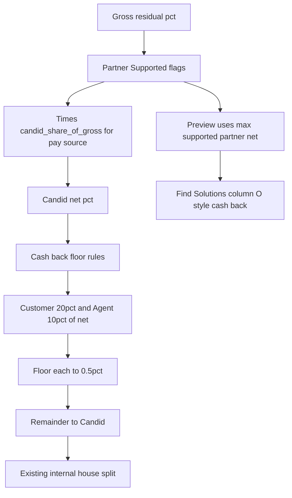
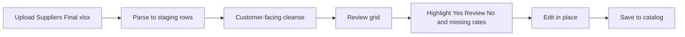

# Member earnings, SPIFF, and commission architecture

**Status:** Active spec — dry-run catalog in admin; live payouts gated.  
**Updated:** 2026-09-21  
**Source:** Cursor plan `earnings_spiff_architecture` + `Suppliers Final.xlsx`  
**Prior source (superseded):** `Import for Cursor.xlsx`

Change queue: **CR-0036** (primary). Find Solutions member UX also tracks **CR-0001**. Plaid / Tech Spend is out of scope.

---

Replace the CR-0014 **per-supplier earnings profile** as the source of truth. That model cannot represent ~2,100+ **Provider Rates** rows across ~860 suppliers, commission-partner portfolios, PartnerStack referrals, or time-boxed SPIFFs in `Suppliers Final.xlsx`. Cash back becomes **a computed share of Candid’s net**, overridable like agent rates already are.

## Admin: Supplier detail (rates UX)

- **Overview** — **Sold Solutions & commission rates** only (legacy sold-solution rows / partner rate chips used on deals).
- **Rates** tab — full **Provider Rates** residual catalog for this supplier (gross, partner Supported?, Candid net = gross × commission partner Candid rate %, with per-product overrides).

Do not bury the Provider Rates catalog on Overview.

### Deal / contract capture

When adding or editing a contract:

1. Choose **supplier / provider** (and pay source when known).
2. **Product** is a **searchable dropdown** of that supplier’s Provider Rates rows.
3. Selecting a product **auto-fills Candid commission rate (%)** = Candid net for the deal’s pay source (or **max supported partner net** if pay source is blank / non-portfolio). Ops can still edit the rate after fill.

These deal rates are what feed customer cash back once the customer share is applied (below).

---

## What the spreadsheet already is

Three catalogs in `Suppliers Final.xlsx`, partly cleansed to customer-facing copy. Rates toward the end of Provider Rates are still incomplete (~352 of ~2,174 rows lack a gross rate); portfolio Yes/No flags may already be filled on those rows.

### Provider Rates (~2,174 rows, ~861 providers; ~1,822 with gross filled)

Residual rate book (product lines, not one % per vendor), plus **which commission partners carry each supplier** and **Candid’s net after each partner’s split**.

| Columns | Meaning |
|---|---|
| `Category`, `Provider`, `Commission Product Name`, `Gross Commission Rate`, `Note` | Supplier residual rate book |
| `{Partner} Supported?` × 5 | Portfolio membership: Intelisys, Sandler, Telarus, AppDirect, AppDirect SaaS (`Yes` / `No` / blank) |
| Per-partner Candid-net rate columns | Default in portal: `gross × partner.candid_commission_rate%` (from Commission Partners). Sheet values / special deals = **overrides**. |
| Column O — `Customer Commissions (Based off 20% percent split)` | Example customer cash back = **20% of the best available partner net** (max of filled partner-rate cells) |

Sheet partner labels use “Intelysys”; map to app pay-source names at import time. Do not rename partners in the app from this sheet alone.

### SPIFFS - Incentives

Name, provider, dates, reward structure (2X–11X MRC, $, residual boost), `Customer-Facing Appropriate?` = Yes / No / Review, and customer copy that already applies **20% of Candid’s SPIFF** (e.g. 3X → 0.6X, $50 → $10).

### PartnerStack

Affiliate/referral programs — often **$ per signup** or **% of ACV**, not monthly residual. Fuller in this workbook than the old import file. Different payout shape than Telco residuals.

### Notes tab (open questions)

Preserve as follow-ups, not blockers for the residual model:

- Other promos (Xfinity Internet, T-Mobile phones, etc.) still need a home
- What is ICB?
- MRR vs MRC wording consistency

CR-0014’s `member_earnings_profile` on `solution_providers` stays as a **fallback/override**, not the catalog.

---

## Target payout math

All % below are **of customer spend (MRC)**, unless noted.

### Candid share of gross (per commission partner)

Defaults live on each **Commission Partner** as **Candid commission rate (%)**. Architecture defaults when unset:

| Partner | Default Candid / partner | Exceptions in the sheet |
|---|---|---|
| **Intelisys** | 80 / 20 | **Vonage → 85** Candid |
| **Sandler** | 85 / 15 | **Effortless & Airespring → 90** Candid (supplier-level `partner_share_overrides`; product nets recalculate) |
| **Telarus** | 85 / 15 | Header currently says `85/10`; filled rates are **85%** of gross (sheet typo) |
| **AppDirect Telco** | 85 / 15 | — |
| **AppDirect SaaS** | 80 / 20 | — |

Per-product **net overrides** when a partner gave a higher split on a specific supplier/SKU.

### Waterfall

```text
grossRate        = supplier published residual %
candidNetPct     = grossRate × candidShareOfPartner(paySource)
                   // or product net override; portfolio Supported? gates eligibility

customerSharePct = customer.cash_back_split_of_candid_net
                   // default 20%; override on customer profile
                   // if customer has a selected customer-agent, use that agent's
                   // customer cash-back split (Agents & team → Agents); else 20%

customerCashBack = customerSharePct × candidNetPct   // of MRC
agentShare       = 10% of candidNet  (default, overridable; 0 if no agent)

Then round customer and agent **down to nearest 0.5%**.
Candid keeps the remainder (effectively rounds up).
```

### Member Find Solutions / supplier card (CR-0001)

When a supplier has **multiple** commission / cash-back lines:

- **List / card teaser:** show the **highest** customer cash-back % as  
  **`Up to {max}% Cash Back`** (never “commission”).
- **Detail (click-through):** list **all** cash-back rows for that supplier with the customer’s savings / cash back for each product line.

Preview when pay source is unknown uses max supported partner net × customer share (column O style).

### Member dashboard + top nav (CR-0001)

Members need cash back outside Find Solutions alone:

- **Dashboard** — cash back / earnings area (pending, earned, paid).
- **Top nav** — Cash back / Earnings entry opening that view.
- **Empty state** — short explanation + **Find Solutions** CTA when they have nothing yet.
- **Paid / deposited** — clear status for lines that have been paid out and deposited.

### Admin Rates → Member View + promos (CR-0036)

On each supplier **Rates** tab, a **Member View** section previews Find Solutions by **customer share tier** (e.g. 10% of ours, 20% of ours): teaser, line-level cash back, and attached SPIFF/promos.

**Candid-authored promos** (alongside imported SPIFFs):

- Structure: **% increase**, **$**, or **multiplier**; **start/end dates**; auto-end.
- Cap: never exceed Candid’s **max take-home**.
- Optional banner creative (image + copy) for Find Solutions **above the supplier list**; option to **email / send campaign**.

**Suppliers admin → Promos page** — portfolio list of active/scheduled/ended promos; modify, end early, send campaign. Per-supplier Member View edits the same campaign objects. Import path remains **CR-0035**.

**Preview when pay source is unknown** (Find Solutions / catalog / column O):

```text
previewCandidNet = max(partner nets for Supported? = Yes with a filled rate)
previewCashBack  = customerSharePct × previewCandidNet
```

At sell time, lock the **actual** pay source on the quote/deal snapshot; stop using the max.

### Worked example (from the sheet — 8x8 at 20% gross)

| Partner | Candid net | Column O (20% of that net) |
|---|---|---|
| Intelisys / Sandler | 16% | 3.2% |
| Telarus / AppDirect Telco | **17%** | **3.4%** ← column O uses this (best available) |

After deal lock on Telarus at 17% Candid net, with defaults:

- Customer 3.4% → floors to **3.0%** (down to 0.5)
- Agent 1.7% → floors to **1.5%**
- Candid remainder **12.5%** (with agent) or **14.0%** (no agent, after customer floor)

This is **not** how payouts work today. Agent Payments take **% of imported residual dollars** (`src/lib/commissions/agent-commission-engine.ts`); member cash back stamps a self-agent residual % (`src/lib/services/member-cashback.ts`). The new engine must sit **in front of** those paths so `MEMBER-*` and selling-agent rates are **outputs**, not independently edited defaults.



Store **gross** on the commission product; store **portfolio + `candid_share_of_gross` per partner** (defaults + supplier exceptions) so `20% × 85%` stays reconstructable. Today’s `solution_provider_solution_rates.rate_pct` / deal `candidCommissionRate` become **outputs of this mapping** (or overrides), not the only place the haircut lives.

---

## Cash-back floors and deal override

Computed customer cash back is **never offered below 1%** after rounding.

| Candid net | Self-signup (no registering agent, or agent waived) | Agent-registered deal |
|---|---|---|
| **< 5%** | No cash back | No cash back |
| **5%–10%** | Customer gets 20% of net (≥1%); **agent override off** | Default: **agent only** (no customer cash back). Ops can split. |
| **≥ 10%** | Customer 20% + agent 10% if an agent is on the deal | Same, unless deal is marked **agent-only** |

The hard override: **if the agent registered the deal and wants the commission, the customer does not get cash back.** Store this on the deal/quote, not only on the supplier:

- `earnings_mode`: `split` (default when allowed) | `customer_only` | `agent_only`
- Defaults from the table above; **always editable** on the quote/deal the same way agent `commissionRate` is today (`bmw_agent_rates` + contract fields).

Per-customer and per-agent defaults (20% / 10%) live on the customer and agent records; deal wins.

---

## Domain model (new source of truth)

Keep suppliers. Add **catalog rows under them**, instead of one JSON profile.

1. **Commission product** (Provider Rates row)  
   Provider + category + supplier SKU name + gross residual % + term rules (new logo / initial only / renewal) + customer-facing name/note.  
   Maps many supplier SKUs → one customer-facing line when you merge in review.

2. **Commission-partner portfolio** (from `{Partner} Supported?`)  
   Which partners support this supplier/product: Intelisys, Sandler, Telarus, AppDirect Telco, AppDirect SaaS.  
   Drives which pay sources are valid on a deal and which nets feed the preview max.

3. **Per-partner `candid_share_of_gross`**  
   Defaults from the split table above; overridable per supplier (Vonage / Effortless / Airespring pattern).  
   Not a single global %. Candid net = `gross × candid_share_of_gross(partner)`.

4. **Sell product** (what the customer orders)  
   Quote/catalog SKU (Goto seat, X2, Super Broadband, …) with **retail price**, **Candid list/sell price**, optional tiers for self-signup.  
   Linked to one or more **commission products** (category vs order product).

5. **Incentive campaign** (SPIFF + Candid promo + “discount as commission”)  
   Multiplier of MRC, extra residual %, or $. Start/end (auto-end). Source: `supplier_spiff` | `candid_promo`.  
   Tied to commission product(s) and/or sell product(s). Customer-facing copy.  
   Customer payout = **same 20% of Candid’s campaign take**, unless overridden.  
   Today’s display-only `member_promos` folds into this.

6. **Referral offer** (PartnerStack)  
   Separate type: `$` or `% of ACV/first year`, not residual waterfall. Still customer-facing “reward,” never “commission.”

7. **Quote/deal snapshot**  
   Freeze: **pay source**, portfolio-eligible partners, gross, Candid net (from that partner’s share), earnings mode, customer/agent %, campaign lines, **pricing mode per sell line**, retail vs invoice vs cash-back delta.  
   Preview cash back may have used max partner net; payouts always use the snapshot so catalog edits don’t rewrite live deals.

---

## Quote pricing modes (both required)

Per line item, not per supplier:

- **`invoice_discount`**: bill the lower Candid price (e.g. $22/seat). Residual is on invoiced MRC. Checkout savings = retail − invoice.
- **`cashback_discount`**: bill closer to retail; the gap is a **Candid-funded cash-back / promo** (same engine as campaigns). Residual stays on the higher billed amount; tax is on the invoice. Checkout still shows retail vs “you pay” vs “you earn.”
- Mix allowed on one quote (e.g. seats invoiced down, onboarding billed full + cash back).

Retail comes from sell product default → quote builder → **manual edit** on checkout (`AcceptQuotePanel` / UCaaS / merchant paths).

---

## SPIFF / rate import and bulk edit

Reuse patterns from `ManualImportModal` + `SupplierRateLinesTable`, not one-at-a-time `MemberEarningsProfileEditor`.



**Review grid columns** (match Provider Rates, plus computed columns):

- Provider, category, commission product, gross %, notes
- Supported? per partner (Intelisys, Sandler, Telarus, AppDirect, AppDirect SaaS)
- Computed Candid-net per partner (editable when exceptions apply)
- Recommended customer cash back (column O formula: 20% of max filled partner net, then floors + 0.5 rounding)
- Customer-facing name / note / reward
- Flags: `Yes` / `Review` / `No` (from SPIFF sheet; generate for Provider Rates when notes are messy, duplicate SKUs, conflicting %)
- Duplicate / conflict highlights (same provider + product, two gross %)
- **Incomplete rows:** allow saving portfolio Yes/No without gross yet; highlight the ~352 trailing suppliers still missing rates

Save writes **commission products + partner portfolio + partner shares + campaigns**, not a blob on the supplier. PartnerStack and SPIFFs are separate import types with the same review UX.

Later: parse raw partner PDFs the way Schedule A already does. First slice is **`Suppliers Final.xlsx` format**.

---

## How this replaces CR-0014 in the UI

| Surface | After |
|---|---|
| Find Solutions | Teaser **Up to {max}% Cash Back** from highest line; detail lists all cash-back rows + savings. Preview = max supported partner net × customer share. Active promo **banners** above supplier list |
| Member dashboard / top nav | Cash back summary; empty → Find Solutions CTA; paid/deposited status (CR-0001) |
| Edit Supplier / Overview | **Sold Solutions & commission rates** only; full catalog on **Rates** tab |
| Supplier Rates → Member View | Per-tier Find Solutions preview + SPIFF/Candid promos (CR-0036) |
| Suppliers → Promos | Portfolio campaign list: modify / send email (CR-0036); SPIFF import via CR-0035 |
| Add / Edit Contract | Searchable Provider Rates product → auto-fill **Candid commission rate (%)** |
| Agent / customer record | Default customer share **20%** of Candid net (customer profile + Agents & team when customer-agent selected); agent share **10%** |
| Quote / deal | Choose pay source from portfolio; lock net; earnings mode; campaign attach; pricing mode; retail |
| Agent Payments | Selling agent rate = **engine output** (or deal override), still paid on imported residual $ |
| Member ledger | Cash back % = **engine output**; stop treating `member_earnings_profile` as residual source |

Internal team splits (`internal-commission-engine.ts`) stay **after** this waterfall: house net = Candid remainder dollars.

---

## Suggested CR sequence (when ready to build)

1. **Catalog + import/review** — Provider Rates / SPIFF / PartnerStack staging, grid, save. **Ingest portfolio Supported? columns and per-partner `candid_share_of_gross` (with exceptions) in this first slice** so Find Solutions preview and deal pay-source picking match the sheet. No live payout change yet.
2. **Payout engine** — Candid net from locked pay source, 20/10, 0.5 floor, cash-back floors, deal `earnings_mode`; wire quote snapshot + agent/member rates.
3. **Campaigns** — time-boxed SPIFF + Candid promos, auto-end, attach to products; retire display-only `member_promos` as the promo system.
4. **Sell products + checkout** — retail, tiers, dual pricing modes, savings display.
