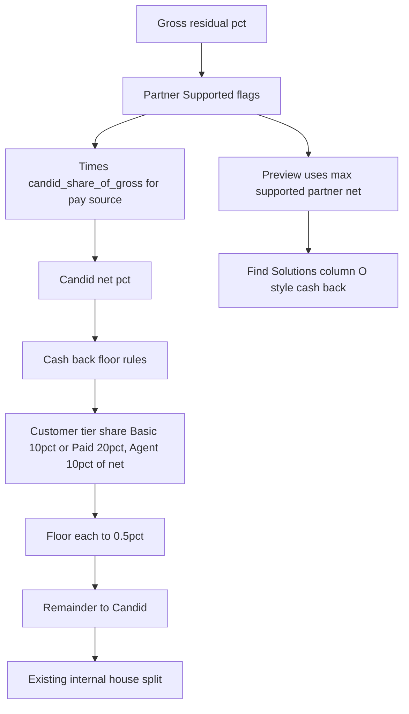
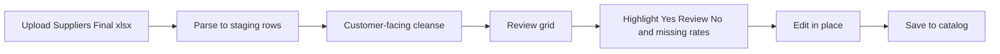

# Member earnings, SPIFF, and commission architecture

**Status:** Active spec — dry-run catalog in admin; live payouts gated.  
**Updated:** 2026-09-28 (promo slider + banner image; tier defaults Basic 10% / Paid 20%; Promos & SPIFFs merged; no share-of-net wording to members)  
**Source:** Cursor plan `earnings_spiff_architecture` + `Suppliers Final.xlsx`  
**Prior source (superseded):** `Import for Cursor.xlsx`

Change queue: **CR-0036** (primary). Find Solutions member UX also tracks **CR-0001**. Plaid / Tech Spend is out of scope.

---

Replace the CR-0014 **per-supplier earnings profile** as the source of truth. That model cannot represent ~2,100+ **Provider Rates** rows across ~860 suppliers, commission-partner portfolios, PartnerStack referrals, or time-boxed SPIFFs in `Suppliers Final.xlsx`. Cash back becomes **a computed share of Candid’s net**, overridable like agent rates already are.

## Admin: Supplier detail (rates UX)

- **Overview** — **Sold Solutions & commission rates** only (legacy sold-solution rows / partner rate chips used on deals).
- **Rates** tab — full **Provider Rates** residual catalog for this supplier (gross, partner Supported?, Candid net = gross × commission partner Candid rate %, with per-product overrides).

Do not bury the Provider Rates catalog on Overview.

### Deal / contract capture

When adding or editing a contract:

1. Choose **supplier / provider** (and pay source when known).
2. **Product** is a **searchable dropdown** of that supplier’s Provider Rates rows.
3. Selecting a product **auto-fills Candid commission rate (%)** = Candid net for the deal’s pay source (or **max supported partner net** if pay source is blank / non-portfolio). Ops can still edit the rate after fill.

These deal rates are what feed customer cash back once the customer share is applied (below).

---

## What the spreadsheet already is

Three catalogs in `Suppliers Final.xlsx`, partly cleansed to customer-facing copy. Rates toward the end of Provider Rates are still incomplete (~352 of ~2,174 rows lack a gross rate); portfolio Yes/No flags may already be filled on those rows.

### Provider Rates (~2,174 rows, ~861 providers; ~1,822 with gross filled)

Residual rate book (product lines, not one % per vendor), plus **which commission partners carry each supplier** and **Candid’s net after each partner’s split**.

| Columns | Meaning |
|---|---|
| `Category`, `Provider`, `Commission Product Name`, `Gross Commission Rate`, `Note` | Supplier residual rate book |
| `{Partner} Supported?` × 5 | Portfolio membership: Intelisys, Sandler, Telarus, AppDirect, AppDirect SaaS (`Yes` / `No` / blank) |
| Per-partner Candid-net rate columns | Default in portal: `gross × partner.candid_commission_rate%` (from Commission Partners). Sheet values / special deals = **overrides**. |
| Column O — `Customer Commissions (Based off 20% percent split)` | Sheet example at the old flat 20% share of the best available partner net. The portal now uses **tier defaults** (Basic 10% / Paid 20%, see Waterfall) — column O equals the **Paid** preview; Basic is half. |

Sheet partner labels use “Intelysys”; map to app pay-source names at import time. Do not rename partners in the app from this sheet alone.

### SPIFFS - Incentives

Name, provider, dates, reward structure (2X–11X MRC, $, residual boost), `Customer-Facing Appropriate?` = Yes / No / Review, and customer copy. The sheet copy was written at a flat 20% of Candid’s SPIFF (e.g. 3X → 0.6X, $50 → $10); the portal recomputes it per member tier (Paid 20% → 0.6X / $10, Basic 10% → 0.3X / $5).

### PartnerStack

Affiliate/referral programs — often **$ per signup** or **% of ACV**, not monthly residual. Fuller in this workbook than the old import file. Different payout shape than Telco residuals.

### Notes tab (open questions)

Preserve as follow-ups, not blockers for the residual model:

- Other promos (Xfinity Internet, T-Mobile phones, etc.) still need a home
- What is ICB?
- MRR vs MRC wording consistency

CR-0014’s `member_earnings_profile` on `solution_providers` stays as a **fallback/override**, not the catalog.

---

## Target payout math

All % below are **of customer spend (MRC)**, unless noted.

### Candid share of gross (per commission partner)

Defaults live on each **Commission Partner** as **Candid commission rate (%)**. Architecture defaults when unset:

| Partner | Default Candid / partner | Exceptions in the sheet |
|---|---|---|
| **Intelisys** | 80 / 20 | **Vonage → 85** Candid |
| **Sandler** | 85 / 15 | **Effortless & Airespring → 90** Candid (supplier-level `partner_share_overrides`; product nets recalculate) |
| **Telarus** | 85 / 15 | Header currently says `85/10`; filled rates are **85%** of gross (sheet typo) |
| **AppDirect Telco** | 85 / 15 | — |
| **AppDirect SaaS** | 80 / 20 | — |

Per-product **net overrides** when a partner gave a higher split on a specific supplier/SKU.

### Waterfall

```text
grossRate        = supplier published residual %
candidNetPct     = grossRate × candidShareOfPartner(paySource)
                   // or product net override; portfolio Supported? gates eligibility

customerSharePct = customer.cash_back_split_of_candid_net
                   // default by member tier: Basic (free) 10%, Paid 20%
                   // override on customer profile
                   // if customer has a selected customer-agent, use that agent's
                   // customer cash-back split (Agents & team → Agents); else tier default

customerCashBack = customerSharePct × candidNetPct   // of MRC
agentShare       = 10% of candidNet  (default, overridable; 0 if no agent)

Then round customer and agent **down to nearest 0.5%**.
Candid keeps the remainder (effectively rounds up).
```

**Member-facing copy rule:** members only ever see the resulting **cash back %** (or $ / multiplier for promos) — e.g. `3% cash back`, `Up to 3.5% Cash Back`. Never show “X% of Candid net”, “of ours”, or the share % anywhere in the member portal. Tier upgrade messaging says **higher cash back** (optionally with an example %), not the split. The share % is admin/internal only.

### Member Find Solutions / supplier card (CR-0001)

When a supplier has **multiple** commission / cash-back lines:

- **List / card teaser:** show the **highest** customer cash-back % as  
  **`Up to {max}% Cash Back`** (never “commission”).
- **Detail (click-through):** list **all** cash-back rows for that supplier with the customer’s savings / cash back for each product line.

Preview when pay source is unknown uses max supported partner net × customer share (column O style).

### Member dashboard + top nav (CR-0001)

Members need cash back outside Find Solutions alone:

- **Dashboard** — cash back / earnings area (pending, earned, paid).
- **Top nav** — Cash back / Earnings entry opening that view.
- **Empty state** — short explanation + **Find Solutions** CTA when they have nothing yet.
- **Paid / deposited** — clear status for lines that have been paid out and deposited.

### Admin Rates → Member View + promos (CR-0036)

On each supplier **Rates** tab, a **Member View** section previews Find Solutions by **member tier** (Basic / Paid — admin sees the underlying 10% / 20% share; the preview itself shows only the member-facing cash back %): teaser, line-level cash back, and attached promos.

### Promos & SPIFFs — one system (CR-0036 / CR-0035)

Supplier SPIFFs and Candid promos are the **same object** (incentive campaign) with a **source** tag: `supplier_spiff` (supplier/partner-funded, usually imported) or `candid_promo` (Candid-funded, authored in admin). Everything else is shared:

- Structure: **% increase**, **$**, or **multiplier**; **start/end dates**; auto-end.
- Cap: never exceed Candid’s **max take-home** (Candid promos) / pass through the tier share of Candid’s SPIFF take (SPIFFs).
- `Customer-facing` flag (Yes / Review / No) on both; only Yes shows to members.
- Slide creative for the Find Solutions **promo slider** (below): headline, sub copy, CTA, and an **optional banner image** — available for SPIFFs too, not just Candid promos; option to **email / send campaign**.

**Suppliers admin → Promos & SPIFFs page** — one portfolio list with **source filter tabs** (All · Candid promos · Supplier SPIFFs) plus a Source badge per row; filter by status (active / scheduled / ended / review). Modify, end early, send campaign. Per-supplier Member View edits the same campaign objects. **Import SPIFFs** (CR-0035) lands rows in this same list as `supplier_spiff`; **New Candid promo** creates `candid_promo`.

Promo / SPIFF editor (drawer from the list or Member View — same form for both sources; source is shown and editable only on create):

- **Banner image (optional)** — upload / replace / remove. Recommended 1600×500, JPG / PNG / WebP. The **supplier logo is always shown** on the slide; the image is additive, never required.
- **Show in Find Solutions slider** toggle and **slide order**.
- **Slide preview** of exactly what members will see.
- List shows a banner thumbnail column (logo placeholder when no image), Source badge, and the slider toggle per row.

### Find Solutions promo slider (CR-0064, builds on CR-0036)

Updated 2026-09-28 after storyboard review. Reference: Rakuten homepage hero carousel.

- **Placement:** in the page content directly under the page header and above the catalog controls (the same spot the admin-preview banner uses). **Not sticky** — it scrolls away with the page. Replaces the earlier thin sticky strip under the top nav.
- **Format:** wide banner **carousel**. One slide in focus with a peek of the next; prev / next arrows, slide counter (`1 / 4`) and dots. Auto-advances (~6s), pauses on hover / focus, swipe on touch, respects reduced-motion.
- **Slide content:** supplier logo tile (always), headline, sub copy (cash-back / promo structure + end date), `Limited promo` pill, **View offer** CTA → supplier detail with the promo highlighted. Optional banner image fills the right side; without one, the slide uses a clean branded background with the logo.
- **Which slides:** active, customer-facing campaigns of either source (Candid promo or supplier SPIFF) with the slider toggle on, within their start/end window, ordered by slide order. Hidden entirely when there are none. Members can dismiss the slider for the session.
- **Storage:** banner images in Supabase Storage, path on the campaign row (e.g. `banner_image_path`), plus `show_in_slider` and `slide_order`.

**Preview when pay source is unknown** (Find Solutions / catalog / column O):

```text
previewCandidNet = max(partner nets for Supported? = Yes with a filled rate)
previewCashBack  = customerSharePct × previewCandidNet
```

At sell time, lock the **actual** pay source on the quote/deal snapshot; stop using the max.

### Worked example (from the sheet — 8x8 at 20% gross)

| Partner | Candid net | Paid preview (20% share) | Basic preview (10% share) |
|---|---|---|---|
| Intelisys / Sandler | 16% | 3.2% | 1.6% |
| Telarus / AppDirect Telco | **17%** | **3.4%** ← column O (best available) | **1.7%** |

After deal lock on Telarus at 17% Candid net, with defaults:

| | Paid member | Basic (free) member |
|---|---|---|
| Customer (floor to 0.5) | 3.4% → **3.0%** | 1.7% → **1.5%** |
| Agent 10% of net (floor to 0.5) | 1.7% → **1.5%** | 1.7% → **1.5%** |
| Candid remainder, with agent | **12.5%** | **14.0%** |
| Candid remainder, no agent | **14.0%** | **15.5%** |

Member sees only `3% cash back` (Paid) or `1.5% cash back` (Basic).

This is **not** how payouts work today. Agent Payments take **% of imported residual dollars** (`src/lib/commissions/agent-commission-engine.ts`); member cash back stamps a self-agent residual % (`src/lib/services/member-cashback.ts`). The new engine must sit **in front of** those paths so `MEMBER-*` and selling-agent rates are **outputs**, not independently edited defaults.


```mermaid
flowchart TD
  gross[Gross residual pct] --> portfolio[Partner Supported flags]
  portfolio --> share[Times candid_share_of_gross for pay source]
  share --> net[Candid net pct]
  net --> floors[Cash back floor rules]
  floors --> shares[Customer tier share Basic 10pct or Paid 20pct, Agent 10pct of net]
  shares --> round[Floor each to 0.5pct]
  round --> candid[Remainder to Candid]
  candid --> house[Existing internal house split]
  portfolio --> preview[Preview uses max supported partner net]
  preview --> display[Find Solutions column O style cash back]
```

Store **gross** on the commission product; store **portfolio + `candid_share_of_gross` per partner** (defaults + supplier exceptions) so `gross × 85%` stays reconstructable. Today’s `solution_provider_solution_rates.rate_pct` / deal `candidCommissionRate` become **outputs of this mapping** (or overrides), not the only place the haircut lives.

---

## Cash-back floors and deal override

Computed customer cash back is **never offered below 1%** after rounding.

| Candid net | Self-signup (no registering agent, or agent waived) | Agent-registered deal |
|---|---|---|
| **< 5%** | No cash back | No cash back |
| **5%–10%** | Customer gets their tier share of net (Basic 10% / Paid 20%, ≥1%); **agent override off** | Default: **agent only** (no customer cash back). Ops can split. |
| **≥ 10%** | Customer tier share + agent 10% if an agent is on the deal | Same, unless deal is marked **agent-only** |

The hard override: **if the agent registered the deal and wants the commission, the customer does not get cash back.** Store this on the deal/quote, not only on the supplier:

- `earnings_mode`: `split` (default when allowed) | `customer_only` | `agent_only`
- Defaults from the table above; **always editable** on the quote/deal the same way agent `commissionRate` is today (`bmw_agent_rates` + contract fields).

Customer share defaults from member tier (Basic 10% / Paid 20%); per-customer and per-agent overrides (agent default 10%) live on the customer and agent records; deal wins. Upgrading Basic → Paid moves the default from 10% to 20% for new deals (locked deals keep their snapshot).

---

## Domain model (new source of truth)

Keep suppliers. Add **catalog rows under them**, instead of one JSON profile.

1. **Commission product** (Provider Rates row)  
   Provider + category + supplier SKU name + gross residual % + term rules (new logo / initial only / renewal) + customer-facing name/note.  
   Maps many supplier SKUs → one customer-facing line when you merge in review.

2. **Commission-partner portfolio** (from `{Partner} Supported?`)  
   Which partners support this supplier/product: Intelisys, Sandler, Telarus, AppDirect Telco, AppDirect SaaS.  
   Drives which pay sources are valid on a deal and which nets feed the preview max.

3. **Per-partner `candid_share_of_gross`**  
   Defaults from the split table above; overridable per supplier (Vonage / Effortless / Airespring pattern).  
   Not a single global %. Candid net = `gross × candid_share_of_gross(partner)`.

4. **Sell product** (what the customer orders)  
   Quote/catalog SKU (Goto seat, X2, Super Broadband, …) with **retail price**, **Candid list/sell price**, optional tiers for self-signup.  
   Linked to one or more **commission products** (category vs order product).

5. **Incentive campaign** — one table for supplier SPIFFs, Candid promos, and “discount as commission”  
   Multiplier of MRC, extra residual %, or $. Start/end (auto-end). **Source: `supplier_spiff` | `candid_promo`** — the only difference; used for filtering, badges, and funding/reporting.  
   Tied to commission product(s) and/or sell product(s). Customer-facing flag + copy, optional banner image, slider toggle + order.  
   Customer payout = **member’s tier share of Candid’s campaign take** (Basic 10% / Paid 20%), unless overridden.  
   Today’s display-only `member_promos` folds into this.

6. **Referral offer** (PartnerStack)  
   Separate type: `$` or `% of ACV/first year`, not residual waterfall. Still customer-facing “reward,” never “commission.”

7. **Quote/deal snapshot**  
   Freeze: **pay source**, portfolio-eligible partners, gross, Candid net (from that partner’s share), earnings mode, customer/agent %, campaign lines, **pricing mode per sell line**, retail vs invoice vs cash-back delta.  
   Preview cash back may have used max partner net; payouts always use the snapshot so catalog edits don’t rewrite live deals.

---

## Quote pricing modes (both required)

Per line item, not per supplier:

- **`invoice_discount`**: bill the lower Candid price (e.g. $22/seat). Residual is on invoiced MRC. Checkout savings = retail − invoice.
- **`cashback_discount`**: bill closer to retail; the gap is a **Candid-funded cash-back / promo** (same engine as campaigns). Residual stays on the higher billed amount; tax is on the invoice. Checkout still shows retail vs “you pay” vs “you earn.”
- Mix allowed on one quote (e.g. seats invoiced down, onboarding billed full + cash back).

Retail comes from sell product default → quote builder → **manual edit** on checkout (`AcceptQuotePanel` / UCaaS / merchant paths).

---

## SPIFF / rate import and bulk edit

Reuse patterns from `ManualImportModal` + `SupplierRateLinesTable`, not one-at-a-time `MemberEarningsProfileEditor`.


```mermaid
flowchart LR
  file[Upload Suppliers Final xlsx] --> parse[Parse to staging rows]
  parse --> cleanse[Customer-facing cleanse]
  cleanse --> grid[Review grid]
  grid --> highlight[Highlight Yes Review No and missing rates]
  highlight --> edit[Edit in place]
  edit --> save[Save to catalog]
```

**Review grid columns** (match Provider Rates, plus computed columns):

- Provider, category, commission product, gross %, notes
- Supported? per partner (Intelisys, Sandler, Telarus, AppDirect, AppDirect SaaS)
- Computed Candid-net per partner (editable when exceptions apply)
- Recommended customer cash back per tier (Paid 20% / Basic 10% of max filled partner net, then floors + 0.5 rounding; Paid = column O)
- Customer-facing name / note / reward
- Flags: `Yes` / `Review` / `No` (from SPIFF sheet; generate for Provider Rates when notes are messy, duplicate SKUs, conflicting %)
- Duplicate / conflict highlights (same provider + product, two gross %)
- **Incomplete rows:** allow saving portfolio Yes/No without gross yet; highlight the ~352 trailing suppliers still missing rates

Save writes **commission products + partner portfolio + partner shares + campaigns**, not a blob on the supplier. PartnerStack and SPIFFs are separate import types with the same review UX; imported SPIFFs save into the shared **Promos & SPIFFs** campaign list as `supplier_spiff`.

Later: parse raw partner PDFs the way Schedule A already does. First slice is **`Suppliers Final.xlsx` format**.

---

## How this replaces CR-0014 in the UI

| Surface | After |
|---|---|
| Find Solutions | Teaser **Up to {max}% Cash Back** from highest line; detail lists all cash-back rows + savings. Preview = max supported partner net × customer share. Active promos in a **non-sticky banner slider** under the page header (logo + optional image) |
| Member dashboard / top nav | Cash back summary; empty → Find Solutions CTA; paid/deposited status (CR-0001) |
| Edit Supplier / Overview | **Sold Solutions & commission rates** only; full catalog on **Rates** tab |
| Supplier Rates → Member View | Basic vs Paid Find Solutions preview (member-facing % only) + attached promos/SPIFFs (CR-0036) |
| Suppliers → Promos & SPIFFs | One campaign list, source filter (Candid promos / Supplier SPIFFs): modify / send email, optional banner image, slider toggle + order (CR-0036, CR-0064); SPIFF import lands here via CR-0035 |
| Add / Edit Contract | Searchable Provider Rates product → auto-fill **Candid commission rate (%)** |
| Agent / customer record | Default customer share by tier — **Basic 10% / Paid 20%** of Candid net (admin-only; override on customer profile + Agents & team when customer-agent selected); agent share **10%** |
| Quote / deal | Choose pay source from portfolio; lock net; earnings mode; campaign attach; pricing mode; retail |
| Agent Payments | Selling agent rate = **engine output** (or deal override), still paid on imported residual $ |
| Member ledger | Cash back % = **engine output**; stop treating `member_earnings_profile` as residual source |

Internal team splits (`internal-commission-engine.ts`) stay **after** this waterfall: house net = Candid remainder dollars.

---

## Suggested CR sequence (when ready to build)

1. **Catalog + import/review** — Provider Rates / SPIFF / PartnerStack staging, grid, save. **Ingest portfolio Supported? columns and per-partner `candid_share_of_gross` (with exceptions) in this first slice** so Find Solutions preview and deal pay-source picking match the sheet. No live payout change yet.
2. **Payout engine** — Candid net from locked pay source, customer tier share (Basic 10% / Paid 20%) + agent 10%, 0.5 floor, cash-back floors, deal `earnings_mode`; wire quote snapshot + agent/member rates.
3. **Campaigns** — one Promos & SPIFFs system (source = supplier SPIFF | Candid promo), time-boxed, auto-end, banner images, attach to products; retire display-only `member_promos` as the promo system.
4. **Sell products + checkout** — retail, tiers, dual pricing modes, savings display.
