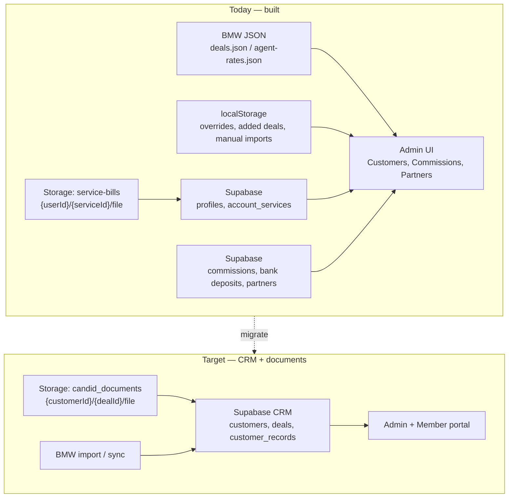

# CandidPortal — Current vs Target Architecture

One-page reference for onboarding (document vault, CRM persistence, integrations).

---

## Stack (both states)

| Layer | Choice |
|-------|--------|
| Framework | **Next.js App Router** (`src/app/`) |
| Language | **TypeScript** (strict) |
| Auth & DB | **Supabase** (Postgres + Auth + Storage) |
| Data access | **Raw Supabase client** — no Prisma/Drizzle |
| UI | **Custom CSS** (`globals.css` + CSS variables), Font Awesome — no Tailwind/shadcn/MUI |
| AI | Anthropic SDK (merchant statement parse, Hank/admin assistant) |

---

## Architecture at a glance



---

## Data model: current vs target

### Customers & deals

| Concern | **Current (shipped)** | **Target (planned)** |
|---------|----------------------|----------------------|
| Customer list | Demo seed + BMW-derived merchants in React state (`CustomersView`) | `customers` table |
| Locations / contacts | In-memory on customer objects | `customer_locations`, `customer_contacts` |
| Deals / contracts | BMW JSON + `customer-contracts-from-deals.ts`; edits in **localStorage** | `deals` table; BMW as import source |
| Deal identity | `paySource::dealUid` (BMW) | `deal_uid` unique + FK to `customers` |
| Pay source / provider | BMW fields + UI types in `customer-records.ts` | `deals.provider`, `deals.source` (pay source) |
| Agent / commission link | BMW `agentCommId` + agent rates JSON | Same fields on `deals` + link to commission engine |

### Documents (contracts, LOAs, invoices)

| Concern | **Current** | **Target** |
|---------|-------------|------------|
| Admin customer docs | Metadata in React state; **files not persisted** | `customer_records` rows + Storage path |
| File bytes | Not stored for admin CRM | Supabase bucket **`candid_documents`** (private) |
| Path convention | N/A | `{customer_id}/{deal_id}/{filename}` (see below) |
| Record types | `RecordKind` in TS (statement, invoice, candid_contract, …) | `customer_records.record_type`, `document_type` |
| OCR / extraction | Filename hints only (`parseContractHintsFromFile`) | Phase 2: optional Claude parse on upload (like merchant PDFs) |
| Member bills | **`service-bills`** bucket — **separate** from CRM docs | Keep separate; optionally link ticket → customer later |

### Partners / suppliers (commissions)

| Concept | **Current** | Notes |
|---------|-------------|-------|
| Commission partners (pay sources) | `partner_suppliers` + bank deposit matching | Built |
| Solution providers (vendors) | `solution_providers` + related tables | Built (migration `0009`) |
| Planned generic `partners` table | Not migrated | Overlaps with `solution_providers` / `partner_suppliers` — **merge conceptually**, don’t duplicate |

---

## Supabase tables today (migrations in repo)

**Auth & member portal:** `profiles`, `account_services`, `analysis_tickets`, `customer_service_tickets`, `bill_upload_fingerprints`

**Commissions & finance:** `partner_suppliers`, `bank_deposit_imports`, `bank_deposit_lines`, `mango_commissions`, `weave_commissions`, plus per-supplier commission tables referenced in code

**Suppliers registry:** `solution_providers`, `solution_provider_contacts`, `solution_provider_solutions`, `solution_provider_solution_rates`

**Storage buckets:** `service-bills` (member uploads)

**Not in migrations yet:** `customers`, `customer_locations`, `customer_contacts`, `deals`, `customer_records`, `candid_documents` bucket

---

## Target CRM schema (from `data/Cursor_Code_Templates.txt`)

```
customers
  └── customer_locations
  └── customer_contacts
  └── deals
        └── customer_records  →  file_path / file_url → candid_documents bucket
```

**Planned `customer_records` fields:** `record_type`, `document_type`, `file_name`, `file_path`, `deal_id`, `customer_id`, `location_id`, `visible_in_portal`

**Planned storage layout:**

```
candid_documents/
  {customer_id}/
    {deal_id}/
      Vonage_Signed_LOA.pdf
      April_2026_Invoice.pdf
```

Alternative (provider folder) if useful for bulk imports from Workdrive:

```
candid_documents/
  {customer_id}/
    {provider_slug}/
      contract.pdf
      invoice_2026-04.pdf
```

Pick one convention and store the canonical path in `customer_records.file_path`.

---

## File formats & parsing

| Use case | Formats | Parsing today | Target |
|----------|---------|---------------|--------|
| Merchant statement analysis | PDF only | Claude via `/api/parse-statement` | Keep |
| Member bill upload | PDF, images, CSV, XLS/XLSX | Store + optional merchant parse | Keep |
| Admin CRM documents | PDF, Excel, images (UI) | Filename hints only | Store as-is; add OCR/extract later |
| Commission reports | XLSX | `xlsx` lib + Supabase tables | Keep |

**Zoho Workdrive:** not integrated. Target path is **import/sync into Supabase Storage**, not live Workdrive API in v1.

---

## localStorage & JSON (migrate away)

| Key / file | Purpose | Target home |
|------------|---------|-------------|
| `src/data/bmw/deals.json` | Deal master | `deals` table (+ periodic BMW import script) |
| `src/data/bmw/agent-rates.json` | Agent tiers | `agent_rates` or keep JSON until agent module matures |
| `candid-added-deals` | New deals from commission UI | `deals` inserts |
| `candid-customer-contract-overrides` | Contract edits | `deals` updates |
| `candid-manual-commission-imports` | Missing supplier reports | Supabase commission tables or verified-match table |
| `candid-verified-pay-source-commissions` | CorpIT-style verify | Commission reconciliation table |

---

## Recommended migration phases

### Phase 1 — CRM persistence (document vault foundation)
1. Run CRM migrations (`customers`, `locations`, `contacts`, `deals`, `customer_records`).
2. Create **`candid_documents`** bucket + RLS (admin write, scoped read).
3. Import S & S sample JSON (`data/Cursor_Code_Templates.txt`) as proof of concept.
4. Wire `CustomersView` / `AddCustomerRecordsModal` to Supabase (upload file → Storage → insert `customer_records`).
5. Sync BMW deals into `deals` (script from existing `import-bmw` pattern).

### Phase 2 — Cut over admin UI
1. Replace in-memory customer seed with DB fetch.
2. Move contract overrides from localStorage to `deals` PATCH.
3. Show documents from `customer_records` with signed download URLs.

### Phase 3 — Intelligence
1. Optional contract PDF extraction (reuse parse-statement pattern).
2. Link member `service-bills` to customer record when email/domain matches.
3. Renewal alerts from `deals.contract_end_date`.

### Phase 4 — External files
1. Bulk import from folder structure (customer name / provider folders).
2. Optional Zoho Workdrive one-way sync job → `candid_documents`.

---

## Quick answers for vendors

- **Next.js?** App Router, TypeScript, Supabase direct — no ORM.
- **Customer/deal tables?** Planned, not live; BMW JSON + UI state today.
- **Where are files?** Member bills → Supabase `service-bills`. Admin CRM docs → **not persisted yet**; target is `candid_documents`.
- **UI library?** Custom CSS, not Tailwind/shadcn.
- **OCR?** Real extraction only for merchant PDFs today; CRM uploads stored as-is initially.

---

*Generated from repo state + `data/Cursor_Code_Templates.txt` / `data/START_HERE.txt`. Update this doc when CRM migrations land.*
